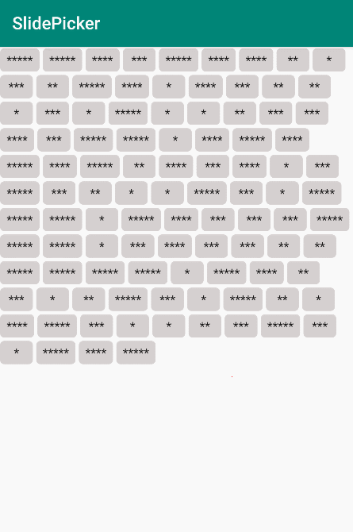
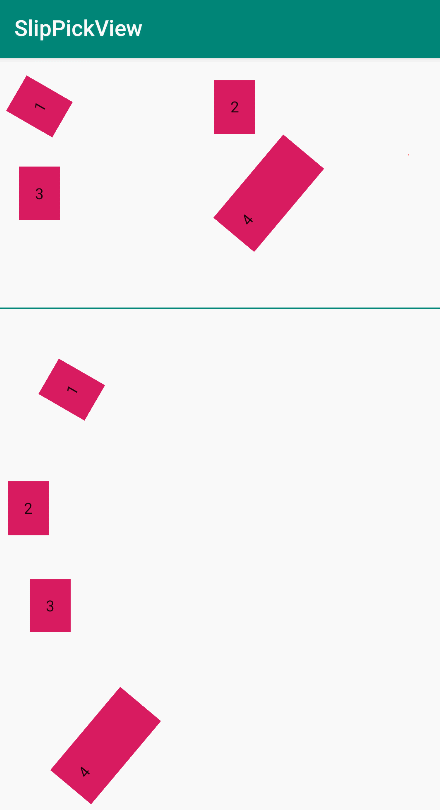

[](https://jitpack.io/#Vove7/SlidePicker)

# Slide Picker

> Android 实现滑动选择视图

- 支持旋转View
- 支持滚动布局


### 使用场景


- 规则布局

像大爆炸那样顺序排列的布局，使用 `FlexboxLayout` 或者 `RecyclerView` 控制。




- 不规则布局

一般用于文字识别框，视图位置通过 `FrameLayout` 使用绝对定位




### Usage

#### 1. 内部 `View` 继承 `android.widget.Checkable`

可以直接使用 `CheckedTextView` 因为它已经继承了 `Checkable` 。那么指定它的背景资源只需分别设置 `state_checked` 就可以动态改变 `选中和未选中` 样式了。

```xml
<selector>
    <item android:state_checked="true">
        ...
    </item>
    <item android:state_checked="false">
        ...
    </item>
</selector>
```

若使用自定义 View 只需继承 `android.widget.Checkable` ，实现 `setChecked` 函数来控制样式。

示例：

```kotlin
class ExampleView @JvmOverloads constructor(
    context: Context, attrs: AttributeSet? = null, defStyleAttr: Int = 0
) : View(context, attrs, defStyleAttr), Checkable {
    private var isChecked = false

    override fun isChecked(): Boolean = isChecked
    override fun toggle() = setChecked(!isChecked)

    override fun setChecked(checked: Boolean) {
        isChecked = checked

        //处理样式
        if (checked) {
            setBackgroundColor(Color.RED)
        } else {
            setBackgroundColor(Color.BLUE)
        }
    }
}
```


#### 2. 指定父级布局


- 文字识别样式

识别的文字外层使用 FrameLayout ，元素 View 指定 `margin` 来绝对定位，即可实现。


此时需要封装父级布局为 `SlideFrameLayout`（内部已实现），继承 FrameLayout 复写 `dispatchTouchEvent` 由 `SlideDelegate` 实现。


```kotlin
class SlideFrameLayout @JvmOverloads constructor(
    context: Context, attrs: AttributeSet? = null, defStyleAttr: Int = 0
) : RelativeLayout(context, attrs, defStyleAttr) {

    private val delegate by lazy { SlideDelegate() }

    override fun dispatchTouchEvent(ev: MotionEvent): Boolean {
        return delegate.onProcessTouchEvent(this, ev)
    }

}
```


- 顺序排列样式

那么使用 `Google` 的 `FlexBoxLayout` 很方便。demo中实现了 `SlideFlexboxLayout`，滑动选择逻辑可自由重写定制。


```kotlin
private fun buildFlexContent(): View {
    val container = SlideFlexboxLayout(this).apply {
        flexWrap = FlexWrap.WRAP
    }
    val rd = Random()
    for (i in 0..100) {
        container.addView(CheckedTextView(this).apply {
            layoutParams = FlexboxLayout.LayoutParams(-2, -2).apply {
                setPadding(20, 10, 20, 10)
                setMargins(5, 5, 5, 5)
            }
            gravity = Gravity.CENTER
            minHeight = 60
            minWidth = 100
            setBackgroundResource(R.drawable.bg_text_selector)
            text = "*" * rd.nextInt(5)
        })
    }
    return container
}
```


### 引入

1. 在工程 `build.gradle` 添加

    ```
    allprojects {
        repositories {
            ...
            maven { url 'https://jitpack.io' }
        }
    }
    ```


2. 添加依赖

    ```
    dependencies {
        implementation 'com.github.Vove7:SlidePickerView:lastest_release'
    }
    ```

    the `latest_release` is 
